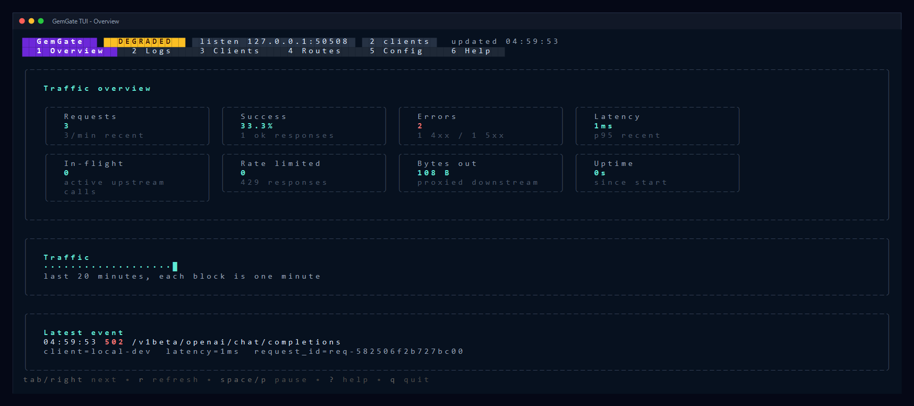
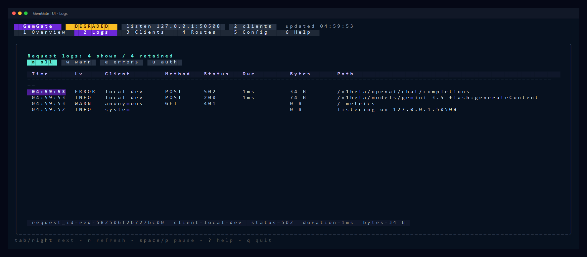
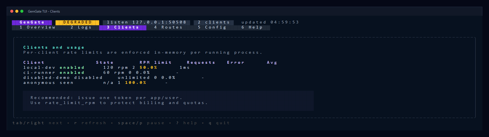
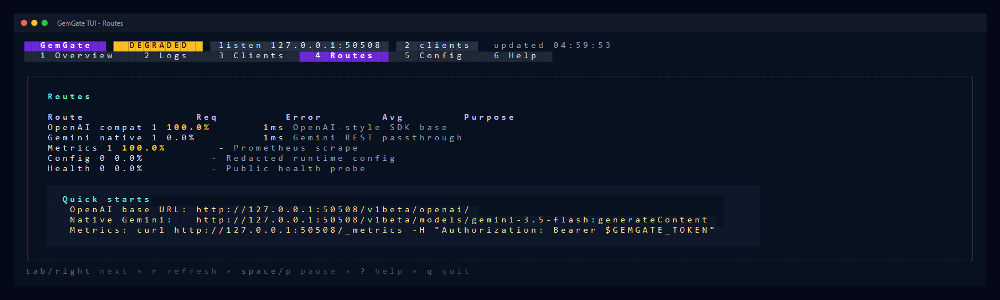

# GemGate

<p align="center">
  <strong>GemGate — легкий Go gateway для Gemini API с TUI, токенами клиентов, метриками и rate limits.</strong>
</p>

<p align="center">
  
  
  
  
</p>

GemGate прячет реальный `GEMINI_API_KEY` на сервере и выдает приложениям отдельные bearer tokens. Он проксирует Gemini native REST и OpenAI-compatible запросы, стримит ответы, показывает live TUI и отдает Prometheus-метрики.

> GemGate не обходит квоты, rate limits или safety-механизмы Google/Gemini. Ответы `429` и safety/quota ошибки upstream передаются клиенту как есть.

## Содержание

- [Возможности](#возможности)
- [Скриншоты TUI](#скриншоты-tui)
- [Быстрый старт](#быстрый-старт)
- [Конфигурация](#конфигурация)
- [Запуск](#запуск)
- [Использование API](#использование-api)
- [TUI: управление](#tui-управление)
- [Operational endpoints](#operational-endpoints)
- [Docker](#docker)
- [Systemd](#systemd)
- [Production notes](#production-notes)
- [Troubleshooting](#troubleshooting)

## Возможности

| Возможность | Что дает |
| --- | --- |
| Серверный Gemini ключ | `GEMINI_API_KEY` не уходит в клиентские приложения. |
| Клиентские токены | Каждому приложению можно выдать отдельный `Authorization: Bearer ...`. |
| OpenAI-compatible proxy | SDK с OpenAI-style `base_url` могут ходить через GemGate. |
| Native Gemini proxy | Поддерживаются обычные `/v1beta/models/...` Gemini REST маршруты. |
| Streaming passthrough | Ответы стримятся клиенту без ожидания полного upstream body. |
| TUI dashboard | Live overview, logs, clients, routes, config, hotkeys. |
| Per-client rate limits | `clients[].rate_limit_rpm` ограничивает потребление по токену. |
| Prometheus metrics | `/_metrics` защищен клиентским bearer token. |
| Redacted config | `/_config` показывает runtime config без раскрытия секретов. |

## Скриншоты TUI

### Overview

Главный экран показывает live-статус, успешность запросов, ошибки, p95 latency, in-flight запросы, rate-limit события, объем трафика и краткий тренд за последние минуты.



### Logs

Экран логов предназначен для быстрой диагностики: фильтры `all / warn / errors / auth`, таблица запросов, статус, latency, bytes out, path и detail выбранной строки.



### Clients и Routes

`Clients` помогает видеть нагрузку по токенам и лимитам. `Routes` показывает расклад по OpenAI-compatible, Gemini native и operational endpoints, а также быстрые URL для SDK и curl.





## Быстрый старт

### 1. Подготовьте конфиг

```bash
cp config.example.yaml config.yaml
```

### 2. Задайте секреты

Bash, macOS или Linux:

```bash
export GEMINI_API_KEY="your-real-gemini-api-key"
export GEMGATE_TOKEN="your-client-facing-token-at-least-32-random-chars"
```

PowerShell:

```powershell
$env:GEMINI_API_KEY="your-real-gemini-api-key"
$env:GEMGATE_TOKEN="your-client-facing-token-at-least-32-random-chars"
```

### 3. Установите зависимости и запустите

```bash
go mod tidy
go run ./cmd/gemgate run -config config.yaml
```

После запуска:

- TUI откроется прямо в терминале.
- Gateway будет слушать адрес из `server.listen`, по умолчанию `:8080`.
- Клиенты должны ходить с заголовком `Authorization: Bearer <GEMGATE_TOKEN>`.

## Конфигурация

Минимальный `config.yaml`:

```yaml
server:
  listen: ":8080"
  read_timeout: "30s"
  write_timeout: "0s"
  idle_timeout: "120s"
  public_health: true
  request_body_limit: "32MiB"

upstream:
  base_url: "https://generativelanguage.googleapis.com"
  api_key: "${GEMINI_API_KEY}"
  timeout: "0s"

clients:
  - name: "local-dev"
    token: "${GEMGATE_TOKEN}"
    enabled: true
    rate_limit_rpm: 120

logging:
  recent: 300
  log_body: false
  log_headers: false
```

### Поля конфига

| Поле | Значение |
| --- | --- |
| `server.listen` | Адрес HTTP-сервера. Пример: `:8080`, `127.0.0.1:8080`. |
| `server.write_timeout` | Для long streaming обычно оставляют `0s`. |
| `server.public_health` | Разрешает публичный `/_healthz` без bearer token. |
| `server.request_body_limit` | Максимальный размер request body. Пример: `32MiB`. |
| `upstream.base_url` | Gemini Developer API host. Обычно менять не нужно. |
| `upstream.api_key` | Реальный Gemini API key. Лучше через `${GEMINI_API_KEY}`. |
| `upstream.timeout` | Общий timeout upstream-запроса. `0s` значит без общего timeout. |
| `clients[].name` | Читаемое имя клиента для логов и TUI. |
| `clients[].token` | Клиентский bearer token. Не используйте Gemini API key. |
| `clients[].rate_limit_rpm` | Request-per-minute лимит для клиента. `0` значит unlimited. |
| `logging.recent` | Размер ring buffer для последних request logs в TUI. |

## Запуск

### TUI + server

```bash
go run ./cmd/gemgate run -config config.yaml
```

Алиас:

```bash
go run ./cmd/gemgate tui -config config.yaml
```

### Headless server

```bash
go run ./cmd/gemgate serve -config config.yaml
```

### Бинарник

```bash
go build -o gemgate ./cmd/gemgate
./gemgate run -config config.yaml
```

Windows:

```powershell
go build -o gemgate.exe ./cmd/gemgate
.\gemgate.exe run -config config.yaml
```

### Версия

```bash
go run ./cmd/gemgate version
```

## Использование API

### OpenAI-compatible SDK base URL

Используйте этот base URL в OpenAI-compatible SDK:

```text
http://localhost:8080/v1beta/openai/
```

Curl:

```bash
curl "http://localhost:8080/v1beta/openai/chat/completions" \
  -H "Authorization: Bearer $GEMGATE_TOKEN" \
  -H "Content-Type: application/json" \
  -d '{
    "model": "gemini-3.5-flash",
    "messages": [
      {"role": "user", "content": "Привет. Ответь коротко."}
    ],
    "stream": false
  }'
```

Python OpenAI SDK:

```python
from openai import OpenAI

client = OpenAI(
    api_key="your-client-facing-token",
    base_url="http://localhost:8080/v1beta/openai/",
)

response = client.chat.completions.create(
    model="gemini-3.5-flash",
    messages=[{"role": "user", "content": "Привет. Ответь коротко."}],
)

print(response.choices[0].message.content)
```

Node.js OpenAI SDK:

```js
import OpenAI from "openai";

const client = new OpenAI({
  apiKey: process.env.GEMGATE_TOKEN,
  baseURL: "http://localhost:8080/v1beta/openai/",
});

const response = await client.chat.completions.create({
  model: "gemini-3.5-flash",
  messages: [{ role: "user", content: "Привет. Ответь коротко." }],
});

console.log(response.choices[0].message.content);
```

### Native Gemini REST

```bash
curl "http://localhost:8080/v1beta/models/gemini-3.5-flash:generateContent" \
  -H "Authorization: Bearer $GEMGATE_TOKEN" \
  -H "Content-Type: application/json" \
  -d '{
    "contents": [
      {"parts": [{"text": "Привет. Ответь коротко."}]}
    ]
  }'
```

## TUI: управление

| Клавиша | Действие |
| --- | --- |
| `1` | Overview: live counters, latency, traffic trend, last event. |
| `2` | Logs: таблица запросов и detail выбранной строки. |
| `3` | Clients: нагрузка и лимиты по клиентским токенам. |
| `4` | Routes: расклад по маршрутам и quick-start URL. |
| `5` | Config: redacted runtime config и security summary. |
| `6` | Help: подсказки и operational notes. |
| `tab`, `right`, `l` | Следующий экран. |
| `shift+tab`, `left`, `h` | Предыдущий экран. |
| `r` | Обновить данные вручную. |
| `space`, `p` | Поставить live refresh на паузу или продолжить. |
| `a` | Logs filter: все записи. |
| `w` | Logs filter: warnings и 4xx. |
| `e` | Logs filter: errors и 5xx. |
| `u` | Logs filter: auth failures. |
| `j/k`, `up/down` | Скролл таблицы логов. |
| `pgup/pgdn`, `g`, `G` | Быстрая навигация по логам. |
| `?` | Развернуть или свернуть help footer. |
| `q`, `ctrl+c` | Выйти из TUI и остановить server. |

## Operational endpoints

Health check, если `server.public_health: true`:

```bash
curl http://localhost:8080/_healthz
```

Prometheus metrics:

```bash
curl http://localhost:8080/_metrics \
  -H "Authorization: Bearer $GEMGATE_TOKEN"
```

Redacted runtime config:

```bash
curl http://localhost:8080/_config \
  -H "Authorization: Bearer $GEMGATE_TOKEN"
```

Основные метрики:

| Метрика | Значение |
| --- | --- |
| `gemgate_requests_total` | Всего proxied requests. |
| `gemgate_requests_2xx_total` | Успешные upstream responses. |
| `gemgate_requests_4xx_total` | Client/upstream 4xx responses. |
| `gemgate_requests_5xx_total` | Upstream/proxy 5xx responses. |
| `gemgate_inflight` | Текущие in-flight requests. |
| `gemgate_bytes_in_total` | Полученные request bytes. |
| `gemgate_bytes_out_total` | Отправленные response bytes. |
| `gemgate_auth_failures_total` | Ошибки авторизации. |
| `gemgate_rate_limited_total` | Запросы, отклоненные client rate limit. |
| `gemgate_upstream_errors_total` | Transport/upstream errors. |

## Docker

```bash
docker compose up --build
```

Перед запуском задайте переменные окружения:

```bash
export GEMINI_API_KEY="your-real-gemini-api-key"
export GEMGATE_TOKEN="your-client-facing-token-at-least-32-random-chars"
docker compose up --build
```

Проверка:

```bash
curl http://localhost:8080/_healthz
```

## Systemd

В репозитории есть пример `gemgate.service`. Типовой порядок:

```bash
sudo cp gemgate /usr/local/bin/gemgate
sudo mkdir -p /etc/gemgate
sudo cp config.example.yaml /etc/gemgate/config.yaml
sudo cp gemgate.service /etc/systemd/system/gemgate.service
sudo systemctl daemon-reload
sudo systemctl enable --now gemgate
sudo systemctl status gemgate
```

Секреты лучше хранить в отдельном environment file с правами только для root/service user.

## Production notes

- Ставьте TLS edge перед GemGate: Caddy, Nginx, Traefik, Cloudflare Tunnel или load balancer.
- Не выдавайте клиентам `GEMINI_API_KEY`. Для каждого приложения используйте отдельный `clients[].token`.
- Для публичных инсталляций задайте `rate_limit_rpm` и внешний rate limit на edge.
- Храните секреты в Docker secrets, systemd environment files, Vault, Kubernetes secrets или другом secret manager.
- Для long streaming оставляйте `server.write_timeout: "0s"`, иначе длинные ответы могут обрываться.
- `rate_limit_rpm` сейчас in-memory per process. При нескольких репликах лимит считается отдельно на каждой реплике.
- `/_metrics` и `/_config` защищены client token. `/_healthz` может быть публичным только если включен `public_health`.

## Troubleshooting

### `invalid proxy token`

Клиент не передал bearer token или передал не тот токен.

```bash
curl http://localhost:8080/_metrics \
  -H "Authorization: Bearer $GEMGATE_TOKEN"
```

Проверьте, что `clients[].enabled: true` и `clients[].token` совпадает с токеном клиента.

### `upstream.api_key is empty`

`GEMINI_API_KEY` не задан или не подставился в `config.yaml`.

```bash
echo "$GEMINI_API_KEY"
```

PowerShell:

```powershell
$env:GEMINI_API_KEY
```

### `429 Too Many Requests`

Есть два варианта:

- `client rate limit exceeded`: сработал `clients[].rate_limit_rpm` внутри GemGate.
- Upstream вернул quota/rate limit: это ограничение Gemini API, GemGate передает его клиенту.

### Streaming обрывается

Проверьте:

- `server.write_timeout: "0s"` в `config.yaml`;
- timeout reverse proxy перед GemGate;
- timeout клиента или SDK.

### TUI не нужен на сервере

Используйте headless mode:

```bash
go run ./cmd/gemgate serve -config config.yaml
```

## Development

```bash
go test ./...
go build ./cmd/gemgate
```

Структура проекта:

```text
cmd/gemgate/          CLI entrypoint
internal/config/      YAML config, env interpolation, validation
internal/gateway/     HTTP proxy, auth, metrics, logs, rate limits
internal/tui/         Charm Bubble Tea terminal UI
docs/assets/          README screenshots
```
