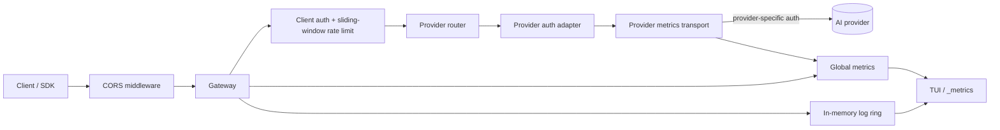

# GemGate architecture

GemGate is intentionally a reverse proxy rather than an API-schema translator. It keeps provider-native payloads intact, owns client authentication at the edge, and injects provider credentials only after a provider has been selected.

## Components



- `internal/config` owns strict YAML parsing, environment expansion, defaults, validation, CORS policy, and legacy `upstream:` migration.
- `internal/provider` is the provider catalog. It contains provider metadata and the smallest possible auth/header policy; it does not know about client tokens, rate limits, or TUI state.
- `internal/gateway` owns HTTP routing, client authentication, rate limiting, CORS middleware, upstream transport, streaming, redaction, operational endpoints, metrics, and logs.
- `internal/tui` consumes gateway snapshots. It contains presentation/interaction logic only and is split by screen/responsibility.
- `cmd/gemgate` is composition only: CLI parsing, setup, lifecycle, and signal handling.

## Routing contract

Two routing modes coexist:

1. `/providers/{name}/{path}` selects a configured provider and strips `/providers/{name}` before forwarding.
2. Any other path is forwarded to `default_provider`. This preserves the v0.2 single-upstream behavior.

Example with `openai` configured as `https://api.openai.com/v1`:

```text
POST /providers/openai/responses
              │
              └──> https://api.openai.com/v1/responses
```

This design deliberately avoids rewriting request/response schemas. OpenAI-compatible providers can share SDKs, while native APIs such as Anthropic and Gemini remain fully accessible.

## Credential boundary

The inbound `Authorization` header authenticates a **GemGate client**, not an AI provider. Before forwarding, GemGate removes known upstream credential headers from the client request. The selected provider adapter then injects its own authentication.

This prevents a client from:

- overriding the server's provider API key;
- accidentally forwarding the GemGate bearer token to a third party;
- injecting `x-api-key`, `api-key`, `x-goog-api-key`, or `anthropic-version` values that bypass server policy.

Custom provider headers are applied from server-side configuration after client headers have been sanitized.

## Provider extension rule

Adding a provider should normally require only one catalog entry in `internal/provider/catalog.go` if its authentication is already represented by an existing mode. A new auth mode should be added only when a provider genuinely requires a different HTTP authentication contract.

Provider-specific request/response transformations do **not** belong in the catalog. If schema translation is ever introduced, it should be a separate explicit adapter layer with its own tests and versioning contract.

## CORS boundary

CORS is handled before `Gateway.ServeHTTP`. This keeps browser-origin policy separate from provider routing and guarantees that upstream responses cannot replace the configured policy.

The policy supports:

- complete disablement;
- exact origin allow-lists or `*`;
- allowed method/header validation for preflight;
- optional credentials for exact origins;
- configurable preflight max-age.

Wildcard origins and credentialed CORS are rejected during config validation.

## Rate limiting

Per-client `rate_limit_rpm` uses an exact rolling one-minute window. This removes the fixed-window boundary case where a client could spend one full quota immediately before a minute boundary and another immediately after it.

The limiter is process-local. Multi-replica deployments that require a global quota need a shared backend; GemGate does not pretend a local counter is globally authoritative.

## Provider observability

Every provider `http.Client` wraps the shared connection-pooled transport with a lightweight metrics transport. It holds provider in-flight state until the response body reaches EOF or is closed, so long streaming responses are represented correctly.

Per-provider snapshots expose:

- total and 2xx/4xx/5xx requests;
- transport failures;
- in-flight requests;
- total/average/last duration;
- last status/time;
- consecutive transport/5xx failures;
- passive `unknown` / `healthy` / `warning` / `degraded` state.

`/_metrics` exports provider-labelled Prometheus series. `/_healthz` exposes only provider names and passive state and remains a process liveness endpoint rather than an active readiness probe.

The passive state intentionally does not cause retries. Generation calls may be non-idempotent and billable, so retry semantics must be introduced explicitly and endpoint-aware if they are ever added.

## TUI architecture

The former all-in-one TUI model was split without introducing a second application architecture:

```text
internal/tui/
├── model.go          # Bubble Tea state, input, refresh lifecycle
├── dashboard.go      # global traffic + provider health summary
├── logs.go           # provider-aware request log
├── clients.go        # client usage and RPM limits
├── providers.go      # provider health/traffic screen
├── config_view.go    # redacted runtime config + CORS state
├── help_view.go      # operator help
├── stats.go          # log aggregation
├── helpers.go        # presentation helpers
├── setup.go          # first-run wizard
└── styles.go         # visual tokens/styles
```

The TUI reads `gateway.ConfigSnapshot`, `gateway.MetricsSnapshot`, and log snapshots. It does not choose auth modes or construct provider requests.

## Timeout model

Each provider owns an `http.Client` timeout. `0s` means no whole-request deadline, which is useful for long model generations and streaming. The underlying transport is shared to retain connection pooling.

Server `write_timeout` defaults to `0s` because a finite server write timeout can terminate long SSE streams.

## Compatibility

The legacy config remains valid:

```yaml
upstream:
  base_url: "https://generativelanguage.googleapis.com"
  api_key: "${GEMINI_API_KEY}"
  timeout: "0s"
```

At load time it is normalized into a single provider named `gemini`. New deployments should use `providers:` and `default_provider:`.

For CORS, omitted settings preserve the previous behavior (`enabled: true`, `allowed_origins: ["*"]`) so existing configs continue to load. New production configs should prefer an explicit origin allow-list or disable CORS when browser access is not needed.

## Deliberate non-goals in v0.3

- schema translation between provider APIs;
- hidden automatic retries of generation requests;
- active provider probes by default;
- distributed rate-limit coordination;
- hot config/key reload.

These can be added as explicit layers without weakening the provider/credential boundary above.
