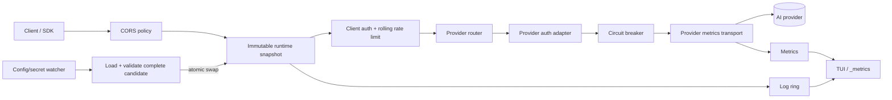

# GemGate architecture

GemGate is intentionally a reverse proxy rather than an API-schema translator. Provider-native payloads stay intact. GemGate owns client authentication at the edge, selects a provider, injects only server-side provider credentials, and streams the upstream response without semantic rewriting.

## Components



Responsibilities:

- `internal/config` — strict YAML, environment expansion, file-backed secrets, defaults, validation and legacy migration;
- `internal/provider` — provider catalogue and provider-specific authentication contract;
- `internal/gateway/gateway.go` — process/server lifecycle and request coordination;
- `internal/gateway/runtime.go` — immutable runtime snapshots and atomic hot reload;
- `internal/gateway/proxy.go` — client auth, routing, request policy and upstream streaming;
- `internal/gateway/circuitbreaker.go` — provider circuit state machine;
- `internal/gateway/provider_metrics_transport.go` — stream-aware provider metrics and circuit enforcement;
- `internal/gateway/readiness.go` / `health.go` — passive readiness and liveness;
- `internal/gateway/http_helpers.go` — header sanitation, request IDs, redaction and streaming helpers;
- `internal/tui` — presentation and operator interaction only;
- `cmd/gemgate` — CLI, config watcher and signal/lifecycle composition.

## Routing contract

Two modes coexist:

1. `/providers/{name}/{path}` selects a configured provider and strips `/providers/{name}` before forwarding.
2. Any other application path is forwarded to `default_provider`.

Example:

```text
POST /providers/openai/responses
              │
              └──> https://api.openai.com/v1/responses
```

Operational paths (`/_healthz`, `/_readyz`, `/_metrics`, `/_config`) are terminated locally and never forwarded upstream.

## Credential boundary

Inbound `Authorization` authenticates a **GemGate client**, not an AI provider. Before forwarding, GemGate strips known upstream credential headers. The selected provider adapter then injects server-side auth.

This prevents a client from:

- overriding the configured provider API key;
- forwarding the GemGate bearer token to a third party;
- injecting `x-api-key`, `api-key`, `x-goog-api-key`, or equivalent provider credentials.

Custom provider headers are also server-side configuration and are applied after client credential sanitation.

## File-backed secrets

Providers support `api_key_file`; clients support `token_file`. Paths may be absolute or relative to `config.yaml`. The complete secret value is read during `config.Load`, trimmed, validated, and kept only in the candidate runtime.

Inline and file-backed versions are mutually exclusive. Empty secret files are rejected.

This allows container/orchestrator/systemd credentials to be rotated without restarting GemGate. The watcher reloads the config and referenced secret files on each configured interval.

## Atomic runtime reload

Reload is intentionally snapshot-based rather than field-by-field mutation:

```text
current runtime
      │
      ├──────────────► in-flight request keeps this snapshot until completion
      │
config/secret change
      ▼
Load → defaults → secret resolution → validation → build complete next runtime
                                                │
                                  failure ──────┴──► reject; keep current runtime
                                                │
                                  success ─────────► atomic pointer swap
                                                              │
                                                       new requests only
```

Properties:

- no request observes a half-applied config;
- existing streaming requests keep their old provider URL/key/token policy until they finish;
- new requests use the new snapshot immediately after swap;
- unchanged client tokens retain their rolling rate-window state;
- provider metrics/circuit state persist by provider name across ordinary reloads;
- `logging.recent` is resized live while retaining newest entries.

Hot-reloadable settings include providers/default provider, provider keys/URLs/headers/timeouts, client tokens/enabled/RPM, CORS, request body limit and log-ring size.

Listener-level server settings (`listen`, read/write/idle timeouts) require restart. Changing them during reload is rejected rather than partially applied.

## CORS boundary

CORS is evaluated from the same immutable runtime snapshot as the rest of the request. The policy supports:

- disablement;
- exact origin allow-lists or `*`;
- allowed method/header validation for preflight;
- optional credentials for exact origins;
- configurable preflight max-age.

Wildcard origins with credentialed CORS are rejected during config validation.

## Rate limiting

Per-client `rate_limit_rpm` uses an exact rolling one-minute window. It prevents the fixed-window boundary double burst.

The limiter is process-local. Multi-replica deployments needing a global quota require a shared enforcement backend.

## Provider observability

Every provider `http.Client` wraps the shared pooled transport with a metrics transport. Provider in-flight duration stays open until response body EOF/Close, so streaming lifetime is represented correctly.

Per-provider snapshots expose requests, status classes, transport failures, in-flight, duration, last status/time, consecutive failures and passive health.

## Circuit breaker

The circuit breaker is deliberately **not a retry layer**.

Current policy:

- transport errors and HTTP 5xx are failures;
- 4xx/429 do not trip the circuit;
- 5 consecutive failures open the circuit;
- open period is 30 seconds;
- requests arriving while open receive a local `503`, `Retry-After` and `X-GemGate-Circuit: open` without touching upstream;
- after cooldown exactly one request becomes the `half_open` probe;
- concurrent requests remain blocked during that probe;
- successful probe closes the circuit; failed probe opens it for another period.

No user generation request is automatically replayed. This avoids hidden duplicate billable/non-idempotent operations.

## Liveness and readiness

`/_healthz` is process liveness plus passive provider-health summary. It stays `200` even when a provider circuit is open.

`/_readyz` is passive readiness:

- it performs no synthetic provider call;
- default provider `closed` circuit => ready;
- default provider `open` or `half_open` => `503` not ready;
- a non-default provider outage does not remove the entire gateway from readiness.

When `server.public_health: true`, both endpoints are public. Otherwise both remain local GemGate operational endpoints protected by normal client bearer authentication.

## TUI architecture

```text
internal/tui/
├── model.go          # Bubble Tea state/input/refresh
├── dashboard.go      # global traffic + provider health
├── logs.go           # provider-aware request log
├── clients.go        # client usage and limits
├── providers.go      # provider state/traffic
├── config_view.go    # redacted runtime config + CORS
├── help_view.go
├── stats.go
├── helpers.go
├── setup.go
└── styles.go
```

TUI consumes snapshots; it never owns provider protocol or auth decisions.

## Timeout model

Each provider owns an `http.Client` timeout. `0s` means no whole-request deadline and is useful for long generation/streaming. The underlying connection pool is shared.

Server `write_timeout` defaults to `0s` because a finite write timeout can terminate long SSE streams.

## Compatibility

Legacy config remains valid:

```yaml
upstream:
  base_url: "https://generativelanguage.googleapis.com"
  api_key: "${GEMINI_API_KEY}"
  timeout: "0s"
```

`upstream.api_key_file` is also supported. At load time legacy config is normalized into a provider named `gemini`.

Omitted CORS settings preserve the historic wildcard behavior for compatibility; new production configs should define an explicit allow-list or disable CORS.

## Deliberate non-goals

- schema translation between provider APIs;
- hidden retries/failover of generation requests;
- synthetic active provider probes by default;
- distributed rate-limit coordination;
- IP-derived trust decisions without an explicit trusted-proxy model.
