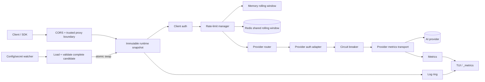

# GemGate architecture

GemGate is intentionally a reverse proxy rather than an API-schema translator. Provider-native payloads stay intact. GemGate owns client authentication at the edge, selects a provider, injects only server-side provider credentials, enforces client policy, and streams the upstream response without semantic rewriting.

## Components



Responsibilities:

- `internal/config` — strict YAML, environment/file-backed secrets, Redis/circuit/CORS/trusted-proxy defaults and validation, legacy migration;
- `internal/provider` — provider catalogue and provider-specific authentication contract;
- `internal/gateway/gateway.go` — process/server lifecycle and request coordination;
- `internal/gateway/runtime.go` — immutable request snapshots and atomic hot reload;
- `internal/gateway/proxy.go` — client auth, routing, request policy, redacted config and upstream streaming;
- `internal/gateway/ratelimit.go` — exact in-memory rolling-window primitive;
- `internal/gateway/ratelimit_backend.go` — backend boundary and token-safe key derivation;
- `internal/gateway/ratelimit_redis.go` — atomic shared Redis rolling window;
- `internal/gateway/circuitbreaker.go` — provider circuit state machine;
- `internal/gateway/provider_metrics_transport.go` — stream-aware provider metrics and circuit enforcement;
- `internal/gateway/trusted_proxy.go` — forwarded-client-IP trust boundary;
- `internal/gateway/readiness.go` / `health.go` — passive readiness and liveness;
- `internal/gateway/http_helpers.go` — header sanitation, request IDs, redaction and streaming helpers;
- `internal/tui` — presentation and operator interaction only;
- `cmd/gemgate` — CLI, config watcher and signal/lifecycle composition.

## Routing contract

Two application-routing modes coexist:

1. `/providers/{name}/{path}` selects a configured provider and strips `/providers/{name}` before forwarding.
2. Any other application path is forwarded to `default_provider`.

Operational paths (`/_healthz`, `/_readyz`, `/_metrics`, `/_config`) are terminated locally and never forwarded upstream.

## Credential boundary

Inbound `Authorization` authenticates a **GemGate client**, not an AI provider. Before forwarding, GemGate strips known upstream credential headers. The selected provider adapter then injects server-side auth.

Client bearer tokens are also never used verbatim as rate-limit storage keys. `rateLimitKey` derives a stable truncated SHA-256 identifier before state reaches either memory or Redis.

Custom provider headers are server-side configuration and are applied after client credential sanitation.

## File-backed secrets

Providers support `api_key_file`; clients support `token_file`; Redis supports `rate_limit.redis.url_file`. Paths may be absolute or relative to `config.yaml`.

Provider/client secret changes are hot-reloadable through the request runtime snapshot. Redis connection settings are process infrastructure and require restart; rotating `url_file` therefore also requires restart.

Inline and file-backed versions of the same secret are mutually exclusive. Empty secret files are rejected.

## Atomic runtime reload

Reload is snapshot-based rather than field-by-field mutation:

```text
current runtime
      │
      ├──────────────► in-flight request keeps this snapshot until completion
      │
config/secret change
      ▼
Load → defaults → secret resolution → validation → build complete next runtime
                                                │
                                  failure ──────┴──► reject; keep current runtime
                                                │
                                  success ─────────► atomic pointer swap
                                                              │
                                                       new requests only
```

Properties:

- no request observes a half-applied provider/client/CORS/trusted-proxy config;
- existing streaming requests keep their old provider URL/key/policy until they finish;
- new requests use the new snapshot immediately after swap;
- provider metrics/circuit state persist by provider name across ordinary reloads;
- the rate-limit manager lives outside request snapshots so in-memory quota survives ordinary reloads;
- Redis quota naturally persists outside any one GemGate process;
- `logging.recent` is resized live while retaining newest entries.

Hot-reloadable: providers/default provider, provider keys/URLs/headers/timeouts/circuit policy, client tokens/enabled/RPM, trusted proxies, CORS, request body limit and log-ring size.

Restart-required: listener read/write/idle settings and rate-limit backend/Redis connection/failure-policy settings. A reload attempting to change restart-only fields is rejected rather than partially applied.

## Rate limiting

`clients[].rate_limit_rpm` always means an exact rolling one-minute quota per client.

### Memory backend

The default backend keeps one rolling `rateWindow` per hashed client id in the process. It is zero-dependency and suitable for a single GemGate instance.

### Redis backend

For horizontally scaled replicas, Redis provides one shared quota:

- one Lua script performs expiry, count, admission and TTL atomically;
- Redis `TIME` is the shared clock, avoiding replica clock skew;
- sorted-set members use a random process instance id plus an atomic sequence;
- Redis keys contain only the hashed client id;
- denied requests receive `Retry-After` from the oldest event remaining in the window.

Backend failures are fail-closed by default: GemGate responds locally with `503` and does not contact the AI provider. `fail_open: true` is explicit opt-in and increments `gemgate_rate_limit_backend_errors_total` while allowing the request.

See `RATE_LIMITING.md`.

## Trusted proxy boundary

`X-Forwarded-For` / `X-Real-IP` are trusted only when the immediate peer and the relevant right-side chain match `server.trusted_proxies`. Untrusted forwarding headers are ignored.

Before upstream forwarding, incoming forwarding headers are stripped and rebuilt from GemGate's resolved client IP. This keeps logs and upstream metadata from inheriting arbitrary client-supplied forwarding chains.

## CORS boundary

CORS is evaluated from the same immutable runtime snapshot as request policy. The policy supports disablement, exact origin allow-lists or `*`, preflight method/header validation, credential policy and max-age. Wildcard origins with credentialed CORS are rejected.

## Provider observability

Every provider `http.Client` wraps the shared pooled transport with a metrics transport. Provider in-flight duration stays open until response body EOF/Close, so streaming lifetime is represented correctly.

Per-provider snapshots expose requests, status classes, transport failures, in-flight, duration, last status/time, consecutive failures, passive health and circuit state.

## Circuit breaker

The breaker is deliberately **not a retry layer**. Transport errors and HTTP 5xx are failures; 4xx/429 are not. Threshold/open interval are configurable per provider. Open requests receive a local `503` without touching upstream; after cooldown exactly one half-open probe is admitted.

No user generation request is automatically replayed. Downstream cancellation is not classified as a provider failure; provider/network timeout is.

## Liveness and readiness

`/_healthz` is process liveness plus passive provider summary and remains `200` when a provider is degraded.

`/_readyz` is passive, quota-free readiness. The default provider's `open`/`half_open` circuit returns `503`; named/non-default provider failure does not make the entire process unready.

## Logging boundary

Operational logs intentionally contain metadata, not prompt/completion bodies or arbitrary request/response headers. Legacy `logging.log_body` and `logging.log_headers` keys remain compatible only as `false`; `true` is rejected until a field-level redaction contract exists.

## TUI architecture

```text
internal/tui/
├── model.go
├── dashboard.go
├── logs.go
├── clients.go
├── providers.go
├── config_view.go
├── help_view.go
├── stats.go
├── helpers.go
├── setup.go
└── styles.go
```

TUI consumes redacted snapshots; it never owns provider auth, Redis credentials or request policy decisions.

## Timeout model

Each provider owns an `http.Client` timeout. `0s` means no whole-request deadline and is useful for long generation/streaming. Server `write_timeout` defaults to `0s` for long streams. Redis has a separate finite backend timeout because it sits on the pre-provider policy path.

## Compatibility

Legacy Gemini-only `upstream:` config remains normalized into provider `gemini`. Omitted CORS retains historic wildcard behavior. Omitted `rate_limit` selects `memory`.

## Deliberate non-goals

- schema translation between provider APIs;
- hidden retries/failover of generation requests;
- synthetic active provider probes by default;
- prompt/completion body capture;
- implicit trust of forwarded client IP headers.
