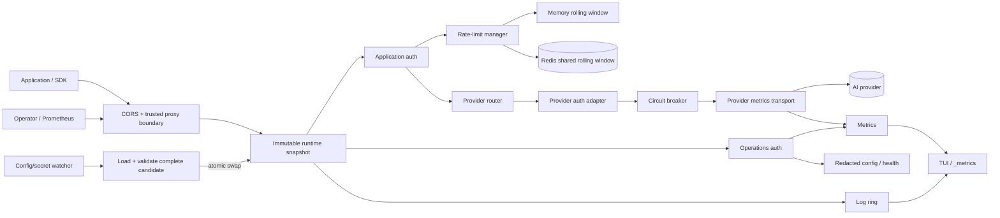

# GemGate architecture

GemGate is intentionally a reverse proxy rather than an API-schema translator. Provider-native payloads stay intact. GemGate owns application authentication, optional operations authentication, policy enforcement, provider selection, server-side provider credentials, resilience and streaming transport.

## Components



Responsibilities:

- `internal/config` — strict YAML, environment/file-backed secrets, operations auth, Redis/circuit/CORS/trusted-proxy defaults and validation, legacy migration;
- `internal/provider` — provider catalogue and provider-specific authentication contract;
- `internal/gateway/gateway.go` — HTTP coordination and separation of data/control-plane routes;
- `internal/gateway/operations_auth.go` — dedicated operations bearer-token boundary;
- `internal/gateway/runtime.go` — immutable request snapshots and atomic hot reload;
- `internal/gateway/proxy.go` — application auth, routing, request policy, redacted config and upstream streaming;
- `internal/gateway/ratelimit.go` — exact in-memory rolling-window primitive;
- `internal/gateway/ratelimit_backend.go` — backend boundary and token-safe key derivation;
- `internal/gateway/ratelimit_redis.go` — atomic shared Redis rolling window;
- `internal/gateway/circuitbreaker.go` — provider circuit state machine;
- `internal/gateway/provider_metrics_transport.go` — stream-aware provider metrics and circuit enforcement;
- `internal/gateway/trusted_proxy.go` — forwarded-client-IP trust boundary;
- `internal/gateway/readiness.go` / `health.go` — passive readiness and liveness;
- `internal/gateway/http_helpers.go` — header sanitation, request IDs, redaction and streaming helpers;
- `internal/tui` — presentation and operator interaction only;
- `cmd/gemgate` — CLI, config watcher and signal/lifecycle composition.

## Data plane vs control plane

Application routes use only `clients[].token` / `token_file`. A configured `operations.token` / `token_file` protects `/_metrics`, `/_config` and private health/readiness. The operations token is deliberately stored outside the application client-token map, so it cannot proxy an AI request.

If `operations:` is omitted, protected operational endpoints retain legacy client-token authentication for backward compatibility. New production deployments should configure dedicated operations auth.

`public_health: true` is an explicit exception: `/_healthz` and `/_readyz` become public, while `/_metrics` and `/_config` remain protected.

## Routing contract

Two application-routing modes coexist:

1. `/providers/{name}/{path}` selects a configured provider and strips `/providers/{name}` before forwarding.
2. Any other non-operational path is forwarded to `default_provider`.

Operational paths are terminated locally and never forwarded upstream.

## Credential boundaries

GemGate has three credential domains:

1. application bearer tokens — authorize proxy traffic;
2. optional operations bearer token — authorizes control-plane endpoints;
3. provider credentials — authenticate GemGate to upstream providers.

A configured operations token must differ from every enabled application token. Dedicated operations comparison is constant-time after bearer parsing.

Before forwarding application traffic, GemGate removes known provider credentials and forwarding headers. The selected provider adapter then injects server-side auth. Application bearer tokens are never forwarded upstream.

Client bearer tokens are also never used verbatim as rate-limit storage keys. A stable truncated SHA-256 identifier is derived before state reaches memory or Redis.

## File-backed secrets

Providers support `api_key_file`; clients support `token_file`; operations supports `token_file`; Redis supports `rate_limit.redis.url_file`.

Provider/client/operations secret changes are hot-reloadable through the immutable runtime snapshot. Redis connection settings are process infrastructure and require restart.

Inline and file-backed versions of the same secret are mutually exclusive. Empty secret files are rejected.

## Atomic runtime reload

Reload is snapshot-based rather than field-by-field mutation:

```text
current runtime
      │
      ├──────────────► in-flight request keeps this snapshot until completion
      │
config/secret change
      ▼
Load → defaults → secret resolution → validation → build complete next runtime
                                                │
                                  failure ──────┴──► reject; keep current runtime
                                                │
                                  success ─────────► atomic pointer swap
                                                              │
                                                       new requests only
```

Properties:

- no request observes a half-applied provider/client/operations/CORS/trusted-proxy config;
- existing streaming requests keep their old provider URL/key/policy until completion;
- operations-token rotation takes effect for new control-plane requests immediately after swap;
- provider metrics/circuit state persist by provider name across ordinary reloads;
- the rate-limit manager lives outside request snapshots so in-memory quota survives ordinary reloads;
- Redis quota naturally persists outside any one GemGate process;
- `logging.recent` is resized live while retaining newest entries.

Hot-reloadable: providers/default provider, provider keys/URLs/headers/timeouts/circuit policy, application tokens/enabled/RPM, operations token, trusted proxies, CORS, request body limit and log-ring size.

Restart-required: listener read/write/idle settings and rate-limit backend/Redis connection/failure-policy settings. A reload attempting to change restart-only fields is rejected rather than partially applied.

## Rate limiting

`clients[].rate_limit_rpm` always means an exact rolling one-minute quota per application client.

The default `memory` backend is process-local. The optional Redis backend uses one Lua operation for expiry/count/admission, Redis `TIME` as the shared clock, token-hash keys and TTL cleanup. Backend failure is fail-closed by default; `fail_open: true` is explicit opt-in and is surfaced through logs and `gemgate_rate_limit_backend_errors_total`.

See `RATE_LIMITING.md`.

## Trusted proxy boundary

`X-Forwarded-For` / `X-Real-IP` are trusted only when the immediate peer and relevant right-side chain match `server.trusted_proxies`. Untrusted forwarding headers are ignored. Before upstream forwarding, incoming forwarding headers are stripped and rebuilt from GemGate's resolved client IP.

## Provider observability and circuit breaker

Every provider client wraps the shared pooled transport with stream-aware metrics. Duration remains open until body EOF/Close, so long SSE streams are represented correctly.

Circuit breakers are deliberately not retry layers. Transport errors and 5xx count as failures; 4xx/429 do not. Open requests receive a local `503` without touching upstream; after cooldown exactly one half-open probe is admitted. No user generation request is automatically replayed.

Downstream cancellation is not classified as provider failure; provider/network timeout is.

## Liveness and readiness

`/_healthz` is process liveness plus passive provider summary. `/_readyz` is passive, quota-free readiness keyed to the default-provider circuit. With dedicated operations auth and `public_health: false`, both require the operations token. With `public_health: true`, only these two endpoints become public.

## Logging boundary

Operational logs intentionally contain metadata, not prompts/completions or arbitrary request/response headers. Legacy `logging.log_body` and `logging.log_headers` are accepted only as `false`; `true` is rejected until a field-level redaction contract exists.

## Release architecture

Normal CI executes the same `scripts/build-release.sh` used by tag releases. It cross-compiles Linux/macOS/Windows for amd64/arm64 and smoke-tests injected version metadata. Version tags additionally publish SHA-256 checksums, an SPDX SBOM and GitHub artifact attestations.

See `RELEASING.md`.

## Deliberate non-goals

- schema translation between provider APIs;
- hidden retries/failover of generation requests;
- synthetic active provider probes by default;
- prompt/completion body capture;
- implicit trust of forwarded client IP headers;
- using operations credentials as application credentials.
