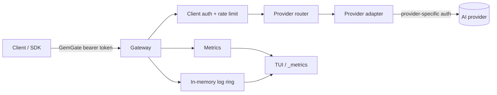

# GemGate architecture

GemGate is intentionally a reverse proxy rather than an API-schema translator. It keeps provider-native payloads intact, owns client authentication at the edge, and injects provider credentials only after a provider has been selected.

## Components



- `internal/config` owns strict YAML parsing, environment expansion, defaults, validation, and legacy `upstream:` migration.
- `internal/provider` is the provider catalog. It contains provider metadata and the smallest possible auth/header policy; it does not know about client tokens, rate limits, or TUI state.
- `internal/gateway` owns HTTP routing, client authentication, rate limiting, upstream transport, streaming, redaction, operational endpoints, metrics, and logs.
- `internal/tui` is an observer/controller surface over gateway snapshots. It must not contain provider protocol logic.
- `cmd/gemgate` is composition only: CLI parsing, setup, lifecycle, signal handling.

## Routing contract

Two routing modes coexist:

1. `/providers/{name}/{path}` selects a configured provider and strips `/providers/{name}` before forwarding.
2. Any other path is forwarded to `default_provider`. This preserves the v0.2 single-upstream behavior.

Example with `openai` configured as `https://api.openai.com/v1`:

```text
POST /providers/openai/responses
              │
              └──> https://api.openai.com/v1/responses
```

This design deliberately avoids rewriting request/response schemas. OpenAI-compatible providers can therefore share SDKs, while native APIs such as Anthropic and Gemini remain fully accessible.

## Credential boundary

The inbound `Authorization` header authenticates a **GemGate client**, not an AI provider. Before forwarding, GemGate removes known upstream credential headers from the client request. The selected provider adapter then injects its own authentication.

This prevents a client from:

- overriding the server's provider API key;
- accidentally forwarding the GemGate bearer token to a third party;
- injecting `x-api-key`, `api-key`, `x-goog-api-key`, or `anthropic-version` values that bypass server policy.

Custom provider headers are applied from server-side configuration after client headers have been sanitized.

## Provider extension rule

Adding a provider should normally require only one catalog entry in `internal/provider/catalog.go` if its authentication is already represented by an existing mode. A new auth mode should be added only when a provider genuinely requires a different HTTP authentication contract.

Provider-specific request/response transformations do **not** belong in the catalog. If schema translation is ever introduced, it should be a separate explicit adapter layer with its own tests and versioning contract.

## Timeout model

Each provider owns an `http.Client` timeout. `0s` means no whole-request deadline, which is useful for long model generations and streaming. The underlying transport is shared to retain connection pooling.

Server `write_timeout` defaults to `0s` because a finite server write timeout can terminate long SSE streams.

## Compatibility

The legacy config remains valid:

```yaml
upstream:
  base_url: "https://generativelanguage.googleapis.com"
  api_key: "${GEMINI_API_KEY}"
  timeout: "0s"
```

At load time it is normalized into a single provider named `gemini`. New deployments should use `providers:` and `default_provider:`.
